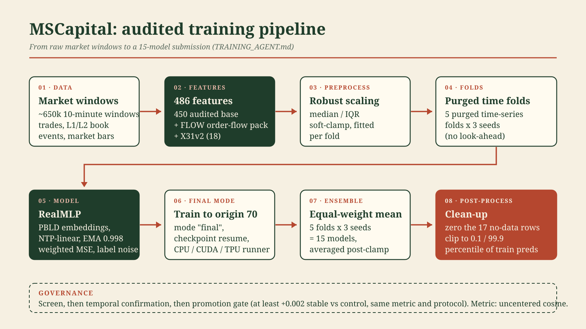

# MSCapital: Real Financial Market Forecasting

**Audited training pipeline (Sep 25):** follow [TRAINING_AGENT.md](TRAINING_AGENT.md)
for the corrected builders, shared CPU/CUDA/TPU runner, temporal confirmation,
checkpoint resume, tests and training budget. Historical scores below were
produced by the earlier pipeline; they are not rescored audit results. In
particular, the old RealMLP `cos_np` was Pearson and aggregated OOF retained the
last seed. Active X30/X31 builders now emit **X30v2/X31v2**; rebuild both splits.

End-to-end research project for the Kaggle competition
[MS Capital: Real Financial Market Forecasting](https://www.kaggle.com/competitions/ms-capital-real-financial-market-forecasting)
(~650k high-frequency market windows; metric: uncentered cosine similarity
between the predicted and realized return vectors, per the competition's own
evaluation tab).



*Audited pipeline, as implemented in [TRAINING_AGENT.md](TRAINING_AGENT.md). Reusable exports: [`docs/pipeline.svg`](docs/pipeline.svg), [`docs/pipeline.png`](docs/pipeline.png).*

**Current standing: public leaderboard 0.141, rank ~125/253** (as of Sep 28, 2026).
Top of board is 0.183; top-10 cut is 0.167; top-20 is 0.158. Work is active
and updated daily. Competition deadline: Oct 9, 2026 16:00 UTC.

## Results trajectory

| Date | Submission | Recipe | Public LB |
|------|-----------|--------|-----------|
| Sep 11 | v6 | LightGBM, 58 microstructure features | 0.110 |
| Sep 15 | v9 | RealMLP 246f, refit-on-full | 0.124 |
| Sep 17 | v13 | RealMLP 450f, 5 purged folds x 3 seeds, holdout + early stopping, 15-model average | 0.139 |
| Sep 18 | v14 | v13 + 75 cross-sectional rank features (XS75) | 0.135 (negative; see below) |
| Sep 20 | v15 | v13 recipe, 5 folds x 5 seeds (25 models) | 0.138 (flat; OOF +0.0005 did not transfer) |
| Sep 28 | flow31 v1 | **Audited pipeline:** RealMLP 486f (450f + FLOW + X31v2), 5 folds x 3 seeds, origin 70, 15-model mean post-clamp (ref 56634145) | **0.141** |

The Sep 28 submission is the first one produced by the post-audit pipeline
(TRAINING_AGENT.md). Its confirmation experiment (40 models, base vs flow31,
2 seeds x 5 folds x 2 external origins) measured **+0.0028 cosine** on two
time blocks never touched by feature screening (months 62-66 and 67-70),
positive in both blocks, both seeds, and all 9 leave-one-month-out folds
(bootstrap 95% CI [+0.0010, +0.0039]) - clearing the guide's promotion gate
(>= +0.002 stable vs control). The leaderboard moved +0.002 (0.139 -> 0.141):
the direction transferred, the magnitude came out somewhat smaller than the
fit-window estimate, which is the expected bias of non-independent CV.

## Current champion (flow31, LB 0.141)

- **Features (486).** The 450-feature audited champion set (298 proprietary
  microstructure + 152 public domain) plus the FLOW order-flow pack
  (multi-level order-flow imbalance, trade-sign autocorrelation, order
  arrival/cancel intensity, queue-imbalance dynamics) and X31v2 (18 features:
  sub-bucket flow burstiness and acceleration, time-weighted OFI,
  volume-weighted order flow, inter-arrival gap statistics, Kyle lambda,
  VPIN-lite). All order-flow builders were rebuilt post-audit with corrected
  chronology (the pre-audit versions had inverted event ordering - every
  pre-audit validation number for these families is invalid).
- **Model.** RealMLP (PBLD embeddings, NTP-linear layers, EMA weights),
  weighted MSE with noisy-target weights (A/B vs clean targets: negative,
  kept noisy), label-noise regularization, flat-then-anneal schedule.
- **Inference protocol.** 5 purged time-series folds x 3 seeds, all models
  trained to origin 70 (mode `final`), equal-weight mean of the 15 models,
  post-clamp. This is the protocol that transferred validation gains to the
  leaderboard in v13 and again in flow31 v1.
- **Post-processing.** Zero the 17 no-data test rows, clip to the 0.1/99.9
  percentile band of train predictions.

## Pre-audit history (v13 era and earlier)

Since v14, eight controlled validation A/Bs on the champion (order-flow stream
aggregates, masked microstructure + liquidity-void features, loss reweighting,
model capacity, correlation pruning, window weighting, clipping, seed
replication) all landed within the fold-to-fold noise floor (~0.004 cosine) -
documented with numbers in the log. Seed replication confirmed a +0.002
"improvement" was pure seed noise, which closed the incremental
feature-stacking line. v15 tested the aggregation ceiling directly: 25 models
instead of 15 moved OOF +0.0005 and the leaderboard not at all (0.138 vs
0.139) - the equal-weight k-fold mean is the ceiling for a fixed recipe;
further gains have to come from new features or architecture.

Sep 24 research: the controlled screen line closed three independent
feature/preprocess hypotheses - RQ-KMeans auxiliary targets (-0.0003),
empirical-quantile feature scaling (mixed, within noise), and price=0
empty-book masking (4 of 5 folds within +-0.0002 of baseline). A full scan of
the public discussion landscape (research/R1_METHODS_LANDSCAPE.md) re-framed
the problem: the board leader states he uses competition data only, so the
~0.16 "public plateau" is a method ceiling, not a data ceiling.
Cross-sectional feature traps were independently confirmed a third time
(CV 0.151 -> LB 0.136): per-sample absolute features only for submissions.

The audit of Sep 25 (commits 38ebbcb, e0ce641) then invalidated every
pre-audit validation number for the X30/X31 order-flow families (inverted
chronology in the raw-stream builders, plus OOF and metric bugs: old `cos_np`
was Pearson, aggregated OOF kept only the last seed). The corrected pipeline
reproduces the 450f control bit-exact (0.17128) and uses the official
uncentered-cosine metric throughout. Everything the project now trains,
screens, confirms and submits goes through this audited path.

Every experiment - including the dead ends - is logged with numbers in
[research/LOG.md](research/LOG.md) and [EXPERIMENTS.md](EXPERIMENTS.md).

## Roadmap (as of Sep 28; owner decision pending)

With 11 days to the deadline and remaining weekly budget (~16h GPU of 30h,
~8.6h TPU of 20h, reset Oct 3), three options are open:

1. **Second final** with more seeds/ensemble over flow31 - expected gain
   small (+0.001 at most), low risk.
2. **New signal research** (advanced order-flow / microstructure) through the
   audited screen -> confirm -> gate pipeline - more upside, more risk.
3. **Stop here** and bank the 0.141.

Gap to the top-10 cut: +0.026; to top-20: +0.017.

## The problem

Each sample is a 10-minute window of high-frequency activity for one asset:
raw trades (price, size, aggressor side), order-book events (L1/L2), and
market bars. The target is the forward return of the window, and the metric
is **cosine similarity** between prediction and target vectors, not a
per-sample error - so the task is to make the prediction *vector* point in
the same direction as the realized-return vector across ~650k test windows.

## What the experiment ledger shows

Closed research lines, each with numbers in the log: cross-sectional /
transductive feature families (within-month ranks computed against global
test - they lift validation and OOF cosine but lose on the public
leaderboard, v13 0.139 vs v14 0.135), sequence models (GRUs
over uniform 1s grids, incl. order-flow streams), adversarial feature
pruning beyond the accepted 5 columns, DANN gradient-reversal domain
adaptation, online learning (impossible in this submission format),
auxiliary targets from future bars, multi-head MLP (TabM-style)
architectures, and ensembles that dilute the champion. The distribution
shift between late-train and test is diffuse (adversarial AUC stays ~0.78
after pruning), which is why alignment approaches fail and feature
engineering is where the gains live.

## Engineering notes

- The data ships as single-batch LZ4-compressed feather files whose
  decompressed record batches exceed 2 GB, so the repo includes a minimal
  flatbuffers/Arrow-IPC parser (`src/arrow_parse.py`) and chunked column
  readers for constant-memory feature building.
- The full research loop (feature builds, GPU/TPU training kernels,
  validation, Kaggle submission, leaderboard tracking) is automated
  end-to-end; kernels and datasets are versioned in `src/kaggle/`.
- Long training runs checkpoint incrementally (per-model OOF/test prediction
  stacks) and resume from `done.json` markers, so a session-timeout cutoff
  never loses completed models.

## Repo map

- `src/` - feature builders, trainers, the Arrow-IPC streaming parser
- `src/kaggle/` - Kaggle kernels (validation and submission) and API tooling;
  canonical training entrypoint `src/kaggle/train_audited.py`
- `research/` - experiment log, confirmation/final artifacts
  (`confirm_flow31_2026-09-27.json`, `final_flow31_2026-09-28.json`,
  `submission_flow31_v1.csv`), discussion mining, reference reimplementations
- `TRAINING_AGENT.md` - the audited training protocol (governing document)
- `EXPERIMENTS.md` - the 30+ experiment ledger with numbers
- `STATE.md`, `STATE_UPDATE.md` - historical snapshots (Sep 12-13, pre-audit);
  kept for provenance only, do not read them as current state

## Reproduce

The commands below reproduce the historical baseline. For current training,
use the explicit configurations and commands in **TRAINING_AGENT.md**.

```bash
bash src/download_data.sh          # needs a Kaggle Bearer token in ~/.kaggle/access_token
pip install -r requirements.txt
python3 src/build_features.py train 1257637 /path/to/data /path/to/work
python3 src/build_features.py test  647896  /path/to/data /path/to/work
python3 src/train_model.py /path/to/data /path/to/work   # writes submission.csv
```
